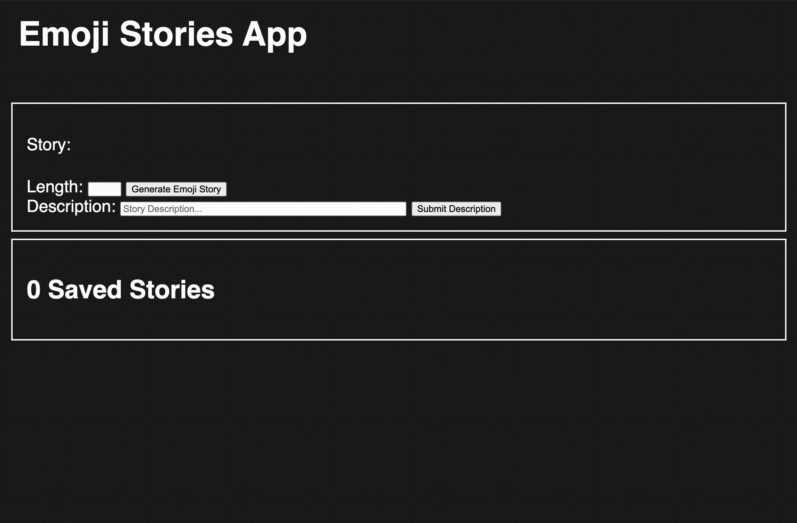

[](https://pursuit.org)

# Practice Assessment: Full Stack Web Mid-Module Two

## Getting Started 
* Fork this repo
* Clone the forked repository
* `cd` to the directory where you cloned it
* `npm install` to install dependencies
* `npm test` to open the cypress testing window

> *Note*: Remember to `git add`, `git commit` and `git push` regularly

## Practice Submission Guidelines
  * No Need to submit! This is meant as practice.


## Practice Assessment Details

Build a website with the following user stories:

- As a user I can select how long of an emoji story to generate
- As a user, I can click a button to generate an emoji story (a string of random emojis)
- As a user, I can submit a description of what is happening in my emoji story
- As a user, I can view my past emoji stories and their descriptions and see a count of how many stories I have saved

## Testing notes:

- The 'Generate Emoji Story' button should have `id="generate-story-btn"`
- There should be an `input[type="number"]` with `id="story-length-input"` 
- Clicking `#generate-story-btn` should add a random emoji story with the right length to an HTML element with `id="emoji-story"`

- There should be an `input[type="text"]` with `id="description-input"`
- The 'Submit Story Description' button should have `id="submit-description-btn"`
- Clicking `#submit-description-btn` should add an emoji story history item with the emoji story and its description

- Your emoji story history items should be `li` elements.
- The only `li` elements should be your emoji history items
- The title of your emoji story history list should be an `h2` tag with `id="history-title"`
- The text of `#history-title` should say '0 Saved Stories', '1 Saved Story', or '${n} Saved Stories', where `n` is more than 1.
- You may include any emojis you like in your random emoji stories. Here's one collection you could use (feel free to add or remove emojis!):

```javascript
const emojis = [
    '😀','😆','😅','🤣','🙃','😍','😡','🥶','😱','👻',
    '👾','😻','💋','👅','🧵','👠','🥾','👑','🎓','🐔',
    '🐧','🦄','🦇','🌲','🎄','🌊','🍓','🍍','🥯','🌭',
    '🍕','🍣','🥡','🤸','🎯','🧨','🔮','💉','🦠','❤️',
    '🧡','💛','💚','💙','💜','☢️','🚫','💯','🔱','🎊'
]
```

## App Demo:

